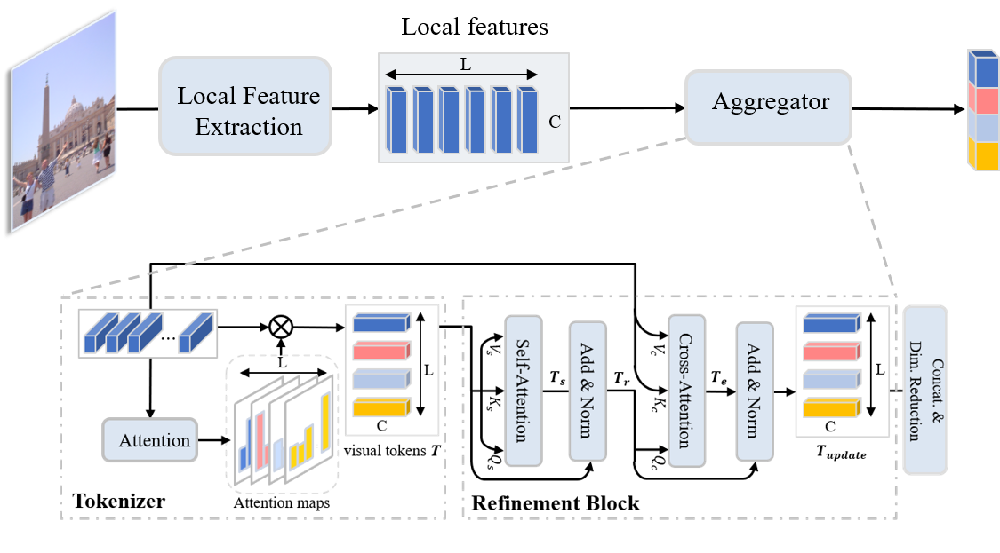
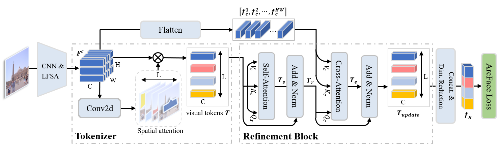

**Token**: Token-Based Representation for Image Retrieval
========
🆕✅🎉 _updated: 21th April 2022: We release different pre-trained models._

# mAP performance of the proposed model
We provide results of **Token**.
mAP is computed with Medium and Hard evaluation protocols.

| Model | ROxf (M) | ROxf + R1M (M) | RPar (M) | RPar + R1M (M) |  ROxf (H) | ROxf + R1M (H) | RPar (H) | RPar + R1M (H) |
|:------|:------:|:------:|:------:|:------:|:------:|:------:|:------:|:------:|
| [R101-HOW + VLAD](https://drive.google.com/file/d/101DDy9aEeOK22xfL4xm2HTaeVBBSSr1k/view?usp=sharing)  | 73.54 | 60.38 | 82.33 | 62.56 | 51.93 | 33.17 | 66.95 | 41.82 |
| [R101-HOW + ASMK](https://drive.google.com/file/d/101DDy9aEeOK22xfL4xm2HTaeVBBSSr1k/view?usp=sharing)  | 80.42 | 70.17 | 85.43 | 68.80 | 62.51 | 45.36 | 70.76 | 45.39 |
| [R01-NetVLAD](https://drive.google.com/file/d/1zESoQbza0c9hqasK8rGJCWoONMV43ekQ/view?usp=sharing)    | 73.91 | 60.51 | 86.81 | 71.31 | 56.45 | 37.92 | 73.61 | 48.98 |
| [R101-RMAC](https://drive.google.com/file/d/12um3mZU2kVNto3MPrZ6FmxFca_tL3Sgi/view?usp=sharing) |75.14 | 61.88 | 85.28 | 67.37 | 53.77 | 36.45 | 71.28 | 44.01 |
| [R101-SOLAR](https://drive.google.com/file/d/1CJNEeE0NDlsl56jnmsZFmPfH-jx32Syh/view?usp=sharing) | 79.65 | 67.61 | 88.63 | 73.21 | 59.99 | 41.14 | 76.15 | 50.98 |
| [R101-DELG](https://drive.google.com/file/d/10WExWiY5cc4-hrQQpQ3yUvOV06f3wYaB/view?usp=sharing) | 78.55 | 66.02 | 88.58 | 73.65 | 60.89 | 41.75 | 76.05 | 51.46 |
| [R50-Token](https://drive.google.com/file/d/111CQpn38d2P82VhbawMrM5wGNMU9AlFq/view?usp=sharing) | 79.79 | - | 88.08 | - | 62.68 | - | 75.49 | - |
| [R101-Token](https://drive.google.com/file/d/1g_fvpaSyYn9QmzyVnoY7cDlUL7EZWbZz/view?usp=sharing) | **82.61** | **70.58** | **89.40** | **77.24** | **65.75** | **47.46** | **78.44** | **56.81** |


🆕✅🎉 _updated: 15th December 2021: We extend the proposed aggregation method to a variety of existing local features._

# The new framework diagram is shown below. For an image, we extract its local features and aggregate them using our proposed method.


The table below shows the performance comparison between ASMK aggregation and our proposed aggregation method. The ASMK aggregator requires offline clustering to generate large codebooks, and our aggregator requires supervised training, where we utilize the GLDv2 dataset for training.

  | Model | ROxf (M) | RPar (M) | ROxf (H) | RPar (H) |
  |:------|:------:|:------:|:------:|:------:|
  | R50-HOW + ASMK  | 79.4 | 81.6 | 56.9 | 62.4 |
  | **R50-HOW+Ours**    | **80.7** | **86.5** | **60.9** | **72.0** |
  | R101-HOW + ASMK | 80.4 | 85.4 | 62.5 | 70.8 |
  | **R101-HOW + Ours** | **83.2** | **87.7** | **64.8** | **75.3** |
  | R50-DELF + ASMK | 67.8 | 76.9 | 43.1 | 55.4 |
  | **R50-DELF + Ours** | **75.2** | **86.0** | **55.0** | **72.2** |

PyTorch training code for **Token**-based Representation for Image Retrieval.
We propose a joint local feature learning and aggregation framework, obtaining **82.3 mAP** on ROxf with Medium evaluation protocols. Inference in 50 lines of PyTorch.



**What it is**. Given an image, **Token** first uses a CNN and a Local Feature Self-Attention (LFSA) module to extract local features $F_c$. Then, they are tokenized into $L$ visual tokens with spatial attention. Further, a refinement
block is introduced to enhance the obtained visual tokens with self-attention and cross-attention. Finally, **Token** concatenates all the
visual tokens to form a compact global representation $f_g$ and reduce its dimension. The aggreegated global feature is discriminative and efficient.

**About the code**. 
**Token** is very simple to implement and experiment with.
Training code follows this idea - it is not a library,
but simply a [train.py](train.py) importing model and criterion
definitions with standard training loops.

# Requirements
- Python 3
- cuda 11.0
- [PyTorch](https://pytorch.org/get-started/locally/) tested on 1.8.0, torchvision 0.9.0
- numpy
- matplotlib


# Usage - Representation learning
There are no extra compiled components in **Token** and package dependencies are minimal,
so the code is very simple to use. We provide instructions how to install dependencies via conda.
Install PyTorch 1.8.0 and torchvision 0.9.0:
```
conda install -c pytorch pytorch torchvision
```

## Data preparation
Before going further, please check out [Google landmarkv2 github](https://github.com/cvdfoundation/google-landmark). We use their training images. If you use this code in your research, please also cite their work!

Download and extract Google landmarkv2 train and val images with annotations from
[https://github.com/cvdfoundation/google-landmark](https://github.com/cvdfoundation/google-landmark).

Download [ROxf](http://www.robots.ox.ac.uk/~vgg/data/oxbuildings) and [RPar](http://www.robots.ox.ac.uk/~vgg/data/parisbuildings) datastes with [annotations](http://cmp.felk.cvut.cz/revisitop/).
We expect the directory structure to be the following:
```
/data/
  ├─ Google-landmark-v2 # train images
  │   ├─ train.csv
  │   ├─ train_clean.csv
  │   ├─ GLDv2-clean-train-split.pkl
  │   ├─ GLDv2-clean-val-split.pkl
  |   └─ train
  └─test # test images
      ├─ roxford5k
      |   ├─ jpg
      |   └─ gnd_roxford5k.pkl
      └─ rparis6k
          ├─ jpg
          └─ gnd_rparis6k.pkl
```

## Training
To train **Token** on a single node with 4 gpus for 30 epochs run:
```
sh experiment.sh
```
A single epoch takes 2.5 hours, so 30 epoch training
takes around 3 days on a single machine with 4 3090Ti cards.

We train **Token** with SGD setting learning rate to 0.01.
The refinement block is trained with dropout of 0.1, and linearly decaying scheduler is adopted to gradually decay the learning rate to 0 when the desired number of steps is reached.

## Evaluation
To evaluate on Roxf and Rparis with a single GPU run:
```
python test.py
```
and get results as below 
```
>> Test Dataset: roxford5k *** local aggregation >>
>> mAP Medium: 82.28, Hard: 66.57

>> Test Dataset: rparis6k *** local aggregation >>
>> mAP Medium: 89.34, Hard: 78.56
```
We found that there is a change in performance when the test environment is different, for example, when the environment is GeForce RTX 2080Ti with cuda 10.2, pytorch 1.7.1 and torchvision 0.8.2, the test performance is
```
>> Test Dataset: roxford5k *** local aggregation >>
>> mAP Medium: 81.36, Hard: 62.09

>> Test Dataset: rparis6k *** local aggregation >>
>> mAP Medium: 90.19, Hard: 80.16
```

# Qualitative examples
Selected qualitative examples of different methods. Top-11 results are shown in the figure. The image with green denotes the true positives and the red bounding boxes are false positives.


